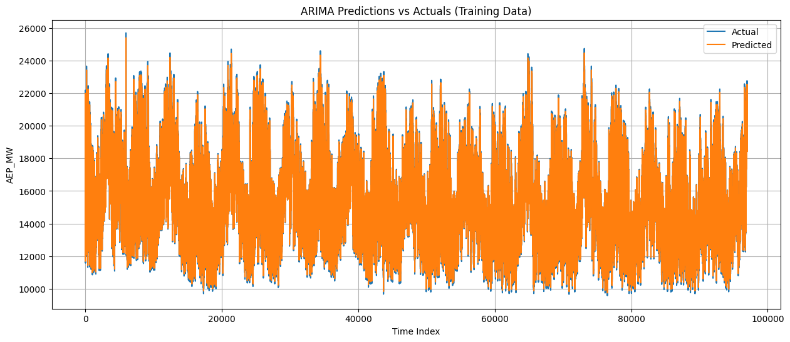
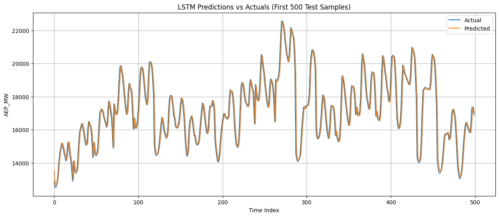

## Short-Term Energy Consumption Forecasting: A Comparative Study of ARIMA and LSTM Models

This research project explores the application of classical statistical models (ARIMA) and deep learning approaches (LSTM) to short-term energy consumption forecasting, providing a comparative analysis of their predictive performance.

📄 **Full Research Report**: [Download PDF](paper.pdf)

For a comprehensive analysis of the methodology, results, and theoretical framework, please refer to the complete research paper.

### 📊 Project Overview

As energy consumption patterns become increasingly complex and non-linear, accurate short-term forecasting has become critical for energy management and grid optimization. This work compares two distinct approaches to time series forecasting:

**ARIMA (Autoregressive Integrated Moving Average)**: A classical statistical model that relies on stationarity assumptions and differencing techniques to capture temporal dependencies in time series data.

**LSTM (Long Short-Term Memory)**: A deep learning architecture based on recurrent neural networks designed to capture long-term dependencies and complex non-linear patterns through memory cells with gating mechanisms.

The study evaluates both models on hourly energy consumption data to determine which approach provides superior forecasting accuracy for short-term predictions.

### 🧮 Methodology

We compared two forecasting approaches:

**ARIMA Model**

ARIMA is a classical statistical model that uses past values and past errors to predict future energy consumption. It works by identifying patterns in historical data and extrapolating them forward. We used ARIMA(1,0,0) configuration in this study.

**LSTM Model**

LSTM is a deep learning model based on neural networks that can learn complex temporal patterns in data. Unlike ARIMA, LSTM can capture non-linear relationships and longer-term dependencies in energy consumption patterns. It uses memory mechanisms to retain important information while filtering out noise.

### 📈 Key Results

Experiments conducted on the Hourly Energy Consumption dataset reveal:

**Superior Performance**: The LSTM model achieved a **65% reduction in Mean Squared Error (MSE)** compared to the ARIMA model, with MSE values of 434,007.12 versus 1,250,099.61 respectively.

**Trend Capture**: While the ARIMA model managed to follow the overall trend of energy consumption, it struggled with complex non-linearities and seasonal fluctuations, resulting in significant residual variability.

**Precise Alignment**: The LSTM network demonstrated remarkable alignment between predicted values and actual observations, even on unseen test data, confirming its ability to model complex sequential dependencies.

| Model         | MSE          |
| ------------- | ------------ |
| ARIMA (1,0,0) | 1,250,099.61 |
| LSTM          | 434,007.12   |

### Visualization of Results

**Figure 1: ARIMA Predictions vs Actual Values**

This figure illustrates the temporal evolution of ARIMA predictions compared to actual energy consumption values. The analysis reveals that while the model captures the general trend, there is significant variability in the residuals, indicating limitations in handling non-stationary components.

**Figure 2: LSTM Predictions vs Actual Values**

The LSTM model demonstrates superior performance with extremely precise alignment between predicted values and actual observations. The network effectively captures complex temporal dependencies that traditional statistical models fail to model.

### 🛠️ Technologies & Tools

- **Language**: Python
- **Statistical Modeling**: statsmodels (ARIMA)
- **Deep Learning**: PyTorch (LSTM)
- **Data Processing**: Pandas, NumPy
- **Visualization**: Matplotlib, Seaborn

### 📚 References

1. Nashirah Abu Bakar and Sofian Rosbi. "Autoregressive Integrated Moving Average (ARIMA) Model for Forecasting Cryptocurrency Exchange Rate in High Volatility Environment: A New Insight of Bitcoin Transaction". In: _IJAERS_ 4.11 (2017), pp. 130–137.

2. Christian Bakke Vennerød, Adrian Kjærran, and Erling Stray Bugge. _Long Short-term Memory RNN_. May 14, 2021. arXiv: 2105.06756[cs].
